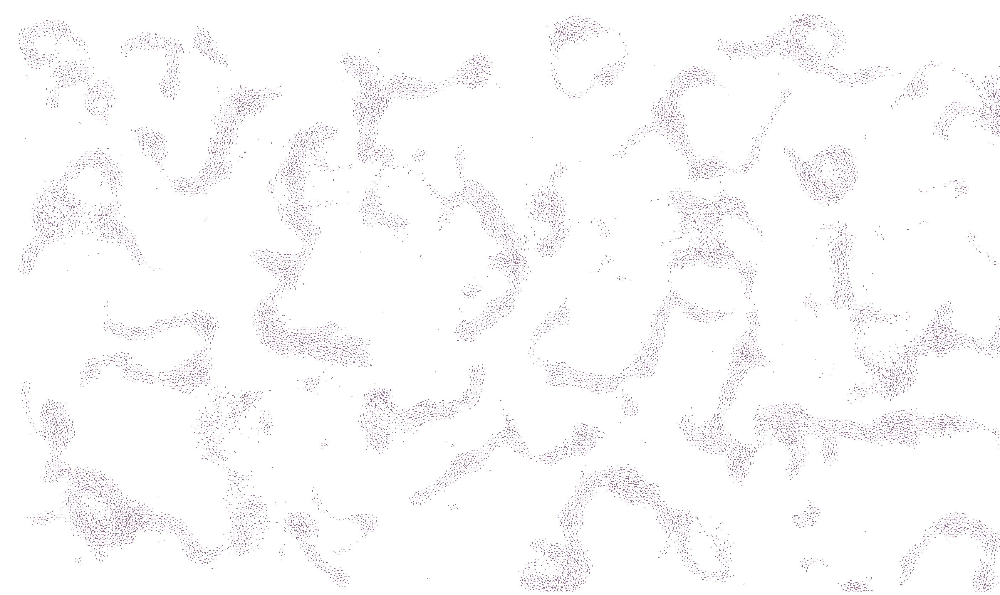

# Simulazione di boids

- [Introduzione](#introduzione)
- [Indicazioni per la compilazione](#indicazioni-per-la-compilazione)
- [Modifiche implementative](#modifiche-implementative)
  - [Boid e BoidState](#boid-e-boidstate)
  - [Flock](#flock)
  - [Funzioni libere richiamate da `Flock::update()`](#funzioni-libere-richiamate-da-flockupdate)
  - [Parallelismo](#parallelismo)
  - [Hashing spaziale](#hashing-spaziale)
  - [Statistics](#statistics)
  - [Interfacce](#Interfacce)
  - [ROOT](#ROOT)
  - [Testing](#Testing)
  - [Flessibilità al numero di dimensioni](#flessibilità-al-numero-di-dimensioni)
## Introduzione
Questa è una riconsegna individuale da parte di Lorenzo Nasi del progetto di gruppo nominato "Simulazione di boids su SFML", che aveva come altri componenti Tommaso Vicenzi e Alice Pezzi. Tommaso Vicenzi ha abbandonato il progetto.

### Principali modifiche 
- modifica delle classi boidstate ed ensemble
- rimozione dell'utilizzo simulaneo di template e polimorfismo, (ora nessuno dei due è presente)
- completata flessibilità del codice di simulare stormi in 2, 3 dimensioni (o potenzialmente a piacere)
- implementazione di hashing spaziale per migliorare la performance e poter sostenere grandi aree generative su SFML
- supporto alla parallelizzazione per migliorare la velocità di esecuzione
- implementazione delle statistiche dello stormo e produzione di grafici tramite ROOT
- aggiunte interfacce per le differenti simulazioni
- completamento del testing
- correzione di errori

## Indicazioni per la compilazione

Per poter produrre gli eseguibili è necessario aver installato `SFML`, con una versione 2.5 o superiore.
Per poter utilizzare il parallelismo della standard library, gli utenti di MacOS dovranno inoltre installare la libreria `oneDPL` del progetto oneAPI di Intel, la quale, tra le varie possibilità, consente il supporto alla parallelizzazione degli algoritmi della standard library su `c++17`. Per scaricarla è sufficiente eseguire 
```bash
$ brew install onedpl
```
da terminale. Per chi compila tramite linux, questa parte può essere ignorata. Gli utenti linux devono però commentare la linea 34 di `CMakeLists.txt`, e tutti gli altri riferimenti alla librerira `TBB` (Thread Building Blocks) di `oneDPL`. Infine gli utenti linux devono modificare, all'interno del file `doublevec.hpp` i riferimenti a:
```c++
#include<oneapi/dpl/algorithms>
#include<oneapi/dpl/execution>
```
trasformandoli negli standard
```c++
#include<algorithms>
#include<execution>
```
Sia per `SFML` che per `TBB` è necessario indicare, all'interno delle `include_directories()` di CMake i rispettivi percorsi.
Infine è necessario aver installato `ROOT` per la visualizzazione dei grafici.

Per costruire la build in debug mode, eseguire:
```bash
$ cmake -S . -B build -DCMAKE_TYPE_BUILD=Debug
```
Per costruire la build in release mode, eseguire invece:
```bash
$ cmake -S . -B build -DCMAKE_TYPE_BUILD=Release
```
la quale abilita opzioni aggressive di ottimizzazione come `-03` e rimuove il debug con `-DNDEBUD`.

I target costruiti dal progetto sono: `boidsfml`, che avvia una simulazione su `SFML`, per cui i parametri della simulazione sono da modificare all'interno del file `parametersfml.txt`; `simulation`, che avvia una simulazione dello stormo in base ai parametri letti dal file `parameters.txt`. All'inizio del programma vengono chiesti i valori di `updates` e `update_rate`, il primo che rappresenta il numero di iterazioni su cui calcolare la statistica, il secondo che specifica il numero di update del sistema prima di ogni registrazione dei dati statistici. Analogamente `simulation3d` avvia la stessa simulazione, ma in 3 dimensioni. Tutti questi eseguibili possono essere fatti eseguire in parallelo, utilizzando l'opzione `--parallel` quando si esegue il programma. Inoltre si segnala come la statistica si riferisca sempre a tutti i boid generati, e quindi, se vengono generati più stormi differenti, i risultati saranno meno significativi.
Sono poi presenti 3 differenti eseguibili di testing: `boids.t` per il testing dello stormo in 2 dimensioni, `boids3d.t` per il testing in 3 dimensioni, e `statistics.t` per il testing della classe di statistica.

## Modifiche implementative

### Boid e BoidState

Le seguenti modifiche sono state apportate:
La classe `BoidState` contiene come membro `boid_` la classe `Boid` , la quale ha a sua volta i membri privati `pos_` e `vel_` di tipo `DoubleVec`, oltre al `flockID_`, di tipo `unsigned int` e al `gridID_`, di tipo `GridID`, che è un alias per `std::array<int, params::dim>`. Il `gridID` rappresenta l'identificatore nella griglia dell'hashing spaziale in cui si trova il boid.
Inoltre la classe `BoidState` contiene come membri `deltavel_`, ovvero un `DoubleVec` che contiene gli update apportati dalle 3 regole, oltre a `neighbors` e `close_neighbors`, degli `std::vector<boid const*>`, ovvero dei vettori di puntatori costanti a boid, che contengono i puntatori ai vicini del boid.

### Flock

La classe `ensemble` è stata sostituita dalla classe `Flock`, che contiene il membro `set_`, un `std::vector<BoidState>` che contiene lo stormo, e `hashMap_`, una hash map costruita su `std::unordered_multimap<>`. Oltre ai metodi di accesso ai membri, essa possiede i metodi `update_hashMap` e `update`, che gestiscono l'update di tutto lo stormo e della mappa.

In particolare, la funzione update esegue due `std::for_each` su tutti gli elementi di `set_`, il primo per aggiornare i vettori dei vicini dei boid e applicare le regole, il secondo per aggiornare le posizioni e le velocità dei boid. Per entrambi i cicli è possibile utilizzare una `ExecPolicy` parallela, con vettorizzazzione. Infine viene ricostruita la hash map con il metodo `update_hashMap`.
### Funzioni libere richiamate da `Flock::update()`

- Le funzioni `speed_adjust`, `bordercheck`, e le regole di volo rimaste pressoché invariate a prima. E' stata aggiunta la funzione `random_boid` per generare un singolo boid casuale. Il `gridID` del boid viene aggiornato tramite la funzione `update_id`, secondo una convenzione trattata più avanti.

- La funzione `is_neighbor` stabilisce se due boid sono vicini in base alla distanza, all'angolo di vista e al criterio di appartenenza allo stormo. In questa funzione, come in altre, vengono fatti confronti tra double, che possono dare risultati imprecisi, soprattuto quando si confrontano con lo zero, ma non è stato possibile trovare soluzioni soddisfacenti in tempo. Inoltre all'interno di questa funzione viene richiamata la funzione `cos_angle_between`, per calcolare l'angolo tra il vettore velocità di un boid, e il vettore differenza con un suo vicino. Quando uno dei due input è zero, la funzione restituisce 0, ma il risultato dovrebbe essere indefinito, in quanto non si può stabilire un angolo. Invece di gestire questa eventualità all'interno della funzione, l'input viene garantito essere diverso da 0, in quanto il parametro `speedminimum` deve essere >0, mentre preliminarmente un boid non viene considerato come vicino se la `distanza==0`, escludendo quindi che il vettore differenza sia uguale a 0. La scelta di non considerare un boid che si trova sulla stessa posizione di un altro come vicino è stata fatta in quanto non è appunto possibile stabilire se in quel caso limite i due boid si vedano o meno, oltre ad essere una condizione rara e transitoria.

- La funzione `add_neighbors` applica la funzione `is_neighbor` all'interno di un range della hash map, determinato in base ad un `gridID` e, nel caso i boid siano vicini, il neihgbor viene aggiunto al vettore dei vicini del boid. La funzione `update_neighbors` applica la funzione `add_neighbors` in tutti i range in un 3x3 o 3x3x3 intorno al range del boid di riferimento.
- La funzione `update_close_neighbors` controlla solo la regola di vicinanza senza l'angolo o il criterio di appartenenza, e prende in input non tutto lo stormo, ma il vettore dei vicini, in quanto tutti i potenziali `close_neighbors` sono anche `neighbors`. Questa funzione viene utilizzata solo quanto è stato generato un solo stormo, mentre negli altri casi la ricerca tra `neighbors` e `close_neighbors` è indifferente. 
- La funzione `update_all_neighbors` aggiorna lo stato di `neighbors_` e `close_neighbors_` di un `BoidState`, utilizzando le funzioni elencate in precedenza.
- La funzione `update_rules` applica le regole di volo, modificando `deltavel_`. 
- La funzione `posvel_update` aggiorna la posizione e la velocità di un singolo boid, applicando poi le regole ai bordi sui limiti di velocità, e aggiornando il `gridID`.

### Parallelismo
Come anticipato in [`Flock`](###Flock), all'interno della funzione update, i `for_each` possono essere eseguiti con l'`ExecPolicy` `par_unseq`. Il codice è stato pensato per poter essere eseguito in ambito di concurrency, in quanto, durante `update_all_neighbors`, per ogni boid:
- Il membro `boid_` viene letto dai vicini, che ha accesso solo a quella parte dell'oggetto
- I membri `close_neighbors_` e `neighbors_` vengono modificati dal boid, ma i vicini non ne hanno accesso

Per questo motivo alcune delle funzioni elencate precedentemente prendono alcuni membri dell'oggetto come `&` e altri come `const&`, per evidenziare cosa viene modificato o meno, invece che passare l'intero oggetto.
In questo modo non c'è alcun membro su cui avvenga <ins>effettivamente</ins> lettura e scrittura contemporanea, creando una data race. Analogamente, durante la `update_rules`, per ogni boid:
- Il membro `deltavel_` viene modificato dal boid
- Il membro `boid_` viene letto dai vicini, che hanno accesso solo a quello.

Quindi anche qui le operazioni possono essere logicamente effettuate in parallelo.

Nonostante ciò, durante il `for_each` in `Flock::update`, all'interno della lambda, viene dato accesso a tutto l'oggetto del range, ovvero il `BoidState`, il quale ha comunque accesso in scrittura al membro `boid_`, anche se effettivamente la scrittura su questo membro non avvenga mai durante la lettura da parte di altri thread. Di conseguenza, data l'accesso in scrittura da parte del boid e in lettura da parte dei vicini, se si esegue il codice con il __Thread Sanitizer__ (opzione `-fsanitize=thread`), ci sono warning di race condition. Per questo motivo il parallelismo è stato inserito come opzione per una maggiore velocità di esecuzione, rimanendo però un'opzione e non una feature definitiva (sarebbero da considerare `lock_guards` o differenti architetture delle classi).

Inoltre è stato deciso di mantenere il parallelismo in quanto non causa altri errori con l'__Address Sanitizer__ (i due Sanitizer sono mutualmente esclusivi), e in quanto l'output del programma eseguito in parallelo è deterministico, e coincide con quello ottenuto con esecuzione sequenziale, a conferma del fatto che i dati vengono gestiti in modo tale da non esserci interferenza nel modo in cui i differenti membri vengono modificati.

### Hashing spaziale

E' stato deciso di implementare un hashing spaziale per migliorare l'efficienza del programma, soprattutto quando l'area di generazione è molto più grande del range visivo di un boid. Normalmente, per controllare chi sono i vicini, un boid deve controllare su tutto lo stormo, e questo deve essere ripetuto per tutti i boid, producendo un algoritmo di ricerca di complessità $O(n^2)$, sia nel best-case che nel worst-case scenario. 

Utilizzando una hash map, l'operazione di ricerca dei vicini per un singolo boid diventa compresa tra $O(1)$ e $O(n)$, dando quindi una complessità di ricerca complessiva di $O(n)$ nel best-case scenario. A questo si deve sommare la complessità dell'applicazione delle regole, che è di $O(n^2)$ nel worst-case scenario, ma che in media si avvicina di più a $O(n)$, in quanto in condizioni di equilibrio dinamico del sistema il numero di vicini per ogni boid dipende scarsamente dalla dimensione totale dello stormo.

La hash map è stata costruita in primo luogo utilizzando un contenitore associativo fornito dalla standard library, ovvero una `std::unordered_multimap`, che consente di creare un contenitore associativo non ordinato in cui è possibile avere più elementi associati ad una stessa chiave, eventualmente anche copie. I parametri di template della mappa sono il `GridID` come chiave e un `boid const*` come valore associato. Dato che GridID non è convertibile direttamente ad un `std::size_t` tramite `std::hash<typename>{}()`, è necessario creare un hasher personalizzato per il tipo `GridID`, in modo simile a `std::hash`. L'approccio che è stato utilizzato prende ispirazione dalla funzione `boost::hash_combine`, che dati due hash value, ne produce uno nuovo applicando delle operazioni bitwise nel seguente modo:
```c++
std::size_t gridID_hash::operator()(GridID const& other) const noexcept
{
  std::hash<int> int_hasher;
  auto result = int_hasher(other[0]);
  std::for_each(other.begin() + 1, other.end(), [&](auto& ID_comp) {
    result ^= int_hasher(ID_comp)  + (result << 6) //+ 0x9e3779b9 optionally
            + (result >> 2);
  });
  return result;
}
```
La prima componente dell'`ID` viene quindi trasformata nell'hash value corrispondente, a cui successivamente viene applicato un __bitwise XOR__ insieme ad un __bitwise right shift__ e __left shift__, a cui si può anche aggiungere una costante grande per rendere più diluiti i risultati ed evitare la sovrapposizione nell'encoding, per tutte le altre componenti. L'XOR è di base un buon metodo per combinare valori di tipo intero, ma è un operatore commutativo, il che significherebbe che (3,1) e (1,3) verrebbero per esempio mappati con lo stesso hash_value. Per questo motivo si aggiungono altre operazioni di bit shifting per creare una mappatura efficace.

L'hasher custom `gridID_hash` così creato viene aggiunto come parametro di template della mappa. E' inoltre necessario definire esplicitamente un `operator==` per `GridID`, in modo tale che la mappa possa confrontare i valori delle chiavi e gestire potenziali collisioni.

L'idea di base dell'hashing spaziale è quella immaginare una griglia sullo spazio di generazione, allineata con gli assi cartesiani, che detta le regole matematiche per l'aggiornamento del `gridID`.

La convenzione che ho scelto è quella qui mostrata: 
```c++
ID_comp = static_cast<int>(std::floor(pos_comp / view_range) + 1);
```
Viene così data priorità al quadrante positivo della generazione, per cui lo spazio (quadrato o cubo che sia), che si trova più vicino all'origine in questo quadrante abbia un `ID` di (1,1), o (1,1,1). Se mi muovo in una cordinata fino a superare un limite della griglia, la corrispettiva componente dell'`ID` aumenterà di 1, (analogamente se vado in negativo).

La griglia secondo la quale vengono stabiliti i valori delle chiavi è quadrata, di lato corrispondente al `view_range` dei boid. In questo modo posso avere la certezza che i potenziali vicini di un boid si trovino in un range di regioni della griglia che hanno coordinate comprese tra -1 e +1 rispetto a quelle del boid di riferimento. 
In due dimensioni, quindi, un boid dovrà controllare le 8 celle intorno alla sua, più la sua, per cercare i vicini.

Se ho a disposizione le chiavi corrispondenti a tutti gli spazi della griglia da considerare, passando un valore di `GridID` alla mappa come parametro del metodo `map.equal_range(key)`, ottengo come risultato un `std::pair` che contiene gli estremi del range di elementi corrispondenti alla chiave.

### Statistics

La statistica si basa sulla classe `Sample`, che contiene i membri `sum_x_`, `sum_x2_` e `N_` e un membro contente media e sigma dei dati di ingresso. Quando la classe viene inizializzata con un `std::vector<double>`, i membri vengono inizializzati in uno stato valido. Con il metodo `add()`, si possono aggiungere elementi al `Sample`.

La struct `FlockStats`, quando inizializzata, prende in input un `std::vector<BoidState>` da cui estrae i `Sample` statistici per ogni componente di `pos_` e `vel_`, per i loro moduli, e per le distanze tra boids.

### Interfacce

Per avviare le varie simulazioni all'interno di un main, la classe `Flock` viene messa all'interno di due interfacce che fanno da wrapper, e contengono altri elementi come un `std::default_random_engine`, o la `ParamList`.

#### SFML_Interface

Per SFML è stata costruita una classe che contiene, oltre a quello già citato, un vettore di colori generati casualmente per i vari stormi di boid, chiamato `colorvec_`, un vettore che contiene gli oggetti che rappresentano i boid su SFML, ovvero `sf::ConvexShape`, chiamato `arrowset_`, e la finestra di SFML, di tipo `sf::RenderWindow`. 
La simulazione viene avviata con il metodo `SFML_Interface::run()`, che richiama il metodo `Flock::update()` e inoltre disegna i boids.

#### Simulation

La classe `Simulation` è il wrapper minimale, che esegue la funzione `Simulation::loop()`, la quale genera e simula i boids per un numero di iterazioni determinato dall'utente. Le statistiche prodotte vengono poi scritte sui file contenuti nella cartella `data`.
Alla fine della simulazione viene data la possibilità di visualizzare i grafici all'interno di ROOT.

### ROOT

I grafici di `ROOT` vengono prodotti dalla funzione `Simulation::loop()`, la quale, tramite `std::system`, consente di eseguire un command line script che apre l'ambiente di ROOT ed esegue funzioni all'interno della macro `flock_data.C`, la quale legge i dati dai file precedentemente prodotti/modificati. I grafici utilizzati sono del tipo `TGraph2DErrors` oppure `TGraphErrors`, dove la deviazione standard del campione della quantità di interesse viene usata nel grafico come se fosse un errore su una misura.

### Testing 

Il testing riprende l'approccio utilizzato nella consegna precedente, includendo alcuni casi limite in più e ampliandolo alle 3 dimensioini.

### Flessibilità al numero di dimensioni

Tutte le operazioni che vengono fatte sui boid, ad eccezione di quelle relative alla parte di SFML, e di ROOT,  sono pensate per funzionare con un valore arbitrario della `static constexpr unsigned int params::dim`, che deve essere noto a compile time. Per rendere possibile l'utilizzo di più valori di `dim`, il suo valore è settato inizialmente a 2 da una macro del preprocessore chiamata `DIM`. Quando si compila il codice, si può quindi settarla a qualsiasi altro valore con l'opzione `-DDIM=value`.

# Esempio
Per concludere:
---
<figure>
    
    <figcaption>Simulazione a 30 FPS con 20000 boids.</figcaption>
</figure>
